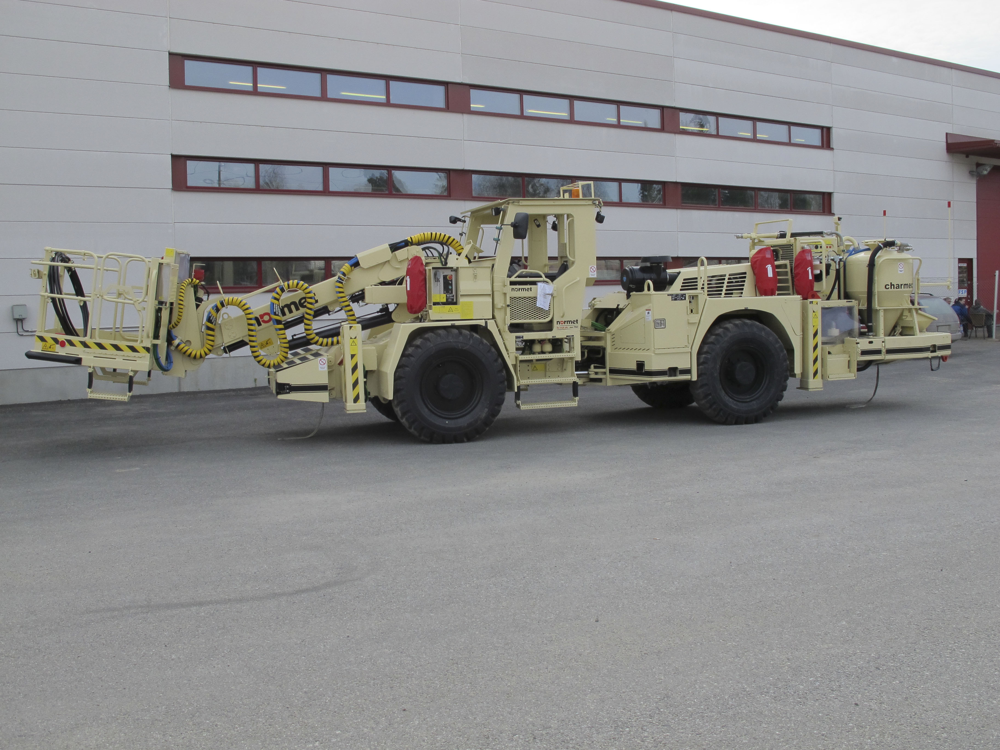

git # Работа с заголовками

## Шрифты

**Полужирный шрифт делается двумя звёздочками**

*Курсив делается одной звёздочкой*

~~Перечеркивание делается подчертой~~

***Жирный курсив три звезды***

## Линии
Ссылка [пример] (https://github.com/OlgaVlasova/markdown-doc/blob/master/README.md)

Ссылка <https://github.com/OlgaVlasova/markdown-doc/blob/master/README.md>

Ссылка <ykonorev@mail.ru>

Картинка 

Сноска [Сноска делается][1] 

[сноска][2]


__________________________
==============
==Перечёркнутый==

## Списки формируются звездочкой
* не сохраняет
* сохраняет


Ссылка [пример] (https://github.com/OlgaVlasova/markdown-doc/blob/master/README.md)

Ссылка <https://github.com/OlgaVlasova/markdown-doc/blob/master/README.md>

Ссылка <ykonorev@mail.ru>

Картинка 

Сноска [Сноска делается][1] 

[сноска][2]


Цитата 
>смотри инструкцию

>изучай маркдаун

>>вложенная цитата

___

[1]: не_сохраняется GIT

Таблицы
Наименование | Партия | Количество
:----------- |:------:| ----------:
Стол         | 11     | 13
Стул         | 12     | 12
Тумба        | 1      | 11

[2]: не_сохраняет


***Списки***
---
1. нумерованный
---
2. >нумерованный
 ---
3. >>нумерованный
--
___
ненумерованный
~~~
списки ненумерованные

* первый
* второй
* третий
~~~

Добавляем строки и таблицы
```
Наименование | Партия | Количество | Дата поставки |
:----------- |:------:| ----------:|--------------:|
Миксер       | 11     |   1        |  20/10/2022   |
Зарядная     | 12     |   2        |  10/09/2022   |
Автобус      | 1      |   2        |  05/12/2022   |
```
----
[1]: не_сохраняется GIT

Таблицы
Наименование | Партия | Количество
:----------- |:------:| ----------:
Стол         | 11     | 13
Стул         | 12     | 12
Тумба        | 1      | 11


Добавили текст

Продолжаем работу 


  Изменяем текст
добавляем строки


ненумерованный
~~~
=== списки ненумерованные ===
* первый
* второй
* третий
~~~
~~~
